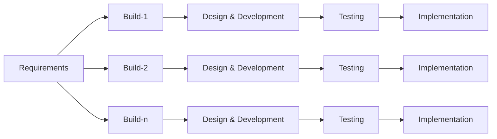

# Compare Incremental to Waterfall

## Graphs, Differences

---
hideInToc: true
---

## Graphs

 

### Waterfall

### Incremental

---
transition: slide-up
hideInToc: true
---

## Differences

|      **Waterfall**      |       **Incremental**        |
| :---------------------: | :--------------------------: |
|         Simple          |           Complex            |
|      Inflexibility      | Flexibility and Adaptability |
| High Risk, Late Testing |  Early Detection of Defects  |
|     Small Projects      |      Suitable for both       |
