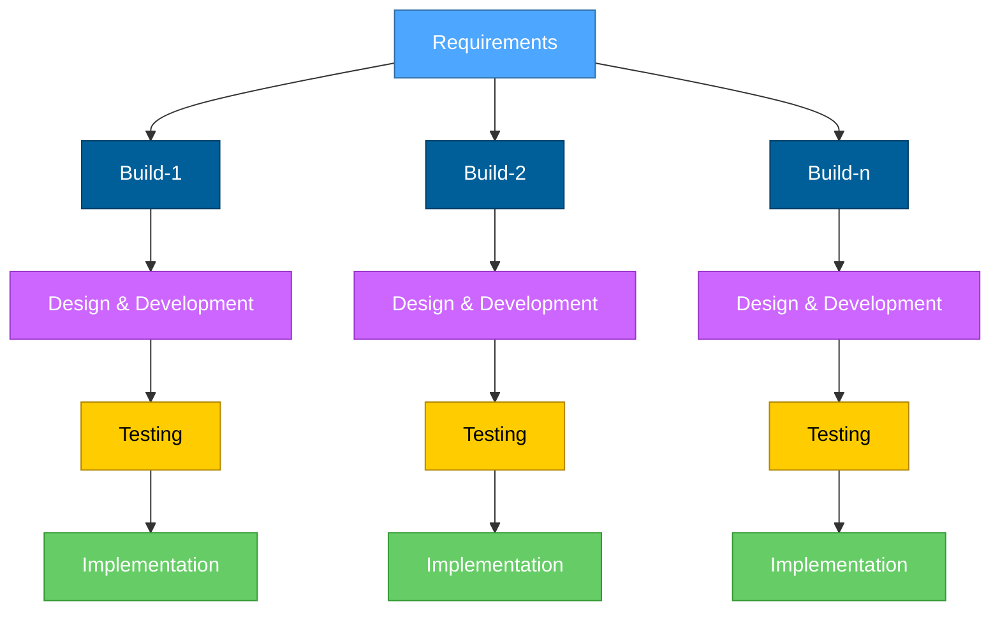

# Introduction

Definition, Characteristics

---
hideInToc: true
---

## **Introduction**

<!-- TODO: Slide to vcl vay? dung` default di -->

    
        Incremental Model is a software developing process in such:
    
    

    <ul class='text-3xl'>
        <li v-click>
            The system is divided into smaller parts called increments.
        </li>
        <li v-click>
            Each increment is developed, tested and implemented independently with each other.
        </li>
        <li v-click>
            Each increment builds upon the previous one by adding new functionality, until the complete system is finished.
        </li>
    </ul>

---
class: text-center
---

<Footnotes>
    Incremental Model
</Footnotes>

---
transition: slide-up
hideInToc: true
---

<!--
Partial System Delivery: The system is developed and delivered in small, manageable pieces. Each part adds new features to the previous version.
Early Functionality: Basic functionality is available early in the project. This allows users to start using and testing the system quickly.
Customer Feedback Loop: Feedback is collected after each part is delivered. This helps improve the next version of the system.
Flexible to Changes: Changes or new features can be added between increments. This makes the model flexible to evolving needs.
Combination of Linear and Iterative Approaches: Combines the structured approach of Waterfall with flexibility. Supports both planning and ongoing improvements.
-->

## **Characteristics**

- Partial System Delivery
- Early Functionality
- Customer Feedback Loop
- Flexible to Changes
- Combination of Linear and Iterative Approaches
