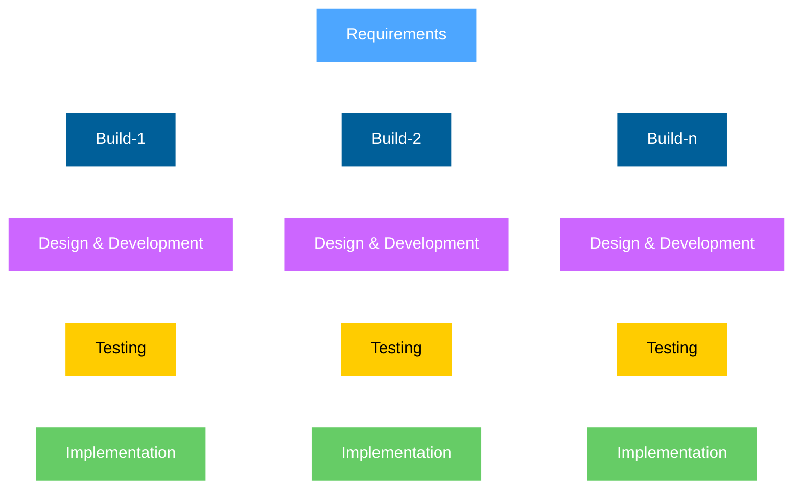

# Giới thiệu về Incremental Model

    
        Incremental Model (Mô hình tăng trưởng) là một phương pháp phát triển phần mềm trong đó:
    
    

    <ul class='text-3xl'>
        <li v-click>
            Hệ thống được chia thành các module nhỏ.
        </li>
        <li v-click>
            Mỗi module được phát triển, kiểm thử và triển khai độc lập với nhau.
        </li>
        <li v-click>
            Các module được tích hợp để tạo thành hệ thống hoàn chỉnh.
        </li>
    </ul>

---
transition: fade-out
class: text-center
---

    Incremental Model

---
transition: fade
---

<!--
Partial System Delivery: The system is developed and delivered in small, manageable pieces. Each part adds new features to the previous version.
Early Functionality: Basic functionality is available early in the project. This allows users to start using and testing the system quickly.
Customer Feedback Loop: Feedback is collected after each part is delivered. This helps improve the next version of the system.
Flexible to Changes: Changes or new features can be added between increments. This makes the model flexible to evolving needs.
Combination of Linear and Iterative Approaches: Combines the structured approach of Waterfall with flexibility. Supports both planning and ongoing improvements.
-->

# **Đặc điểm chính (Characteristics)**

<ul class='text-3xl mt-10'>
    <li>
        Partial System Delivery
    </li>
    <li>
        Early Functionality
    </li>
    <li>
        Customer Feedback Loop
    </li>
    <li>
        Flexible to Changes
    </li>
    <li>
        Combination of Linear and Iterative Approaches
    </li>
</ul>
