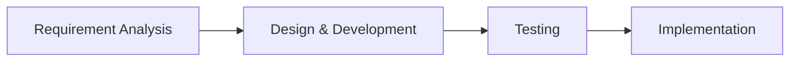

# **Phases of Incremental Model**

---
hideInToc: true
---

# **Phases of Incremental Model**

Incremental model is divided into 4 main phases:

In each phase, the process continues until we got the expected output at the end.

---
hideInToc: true
---

## **Requirement Analysis**

- The first step in the Incremental Model is understanding what the software needs to do. The team gathers the requirements from the product experts and clearly defines the system’s functional needs.
- This phase is important because it sets the foundation for everything else in the development process.

---
hideInToc: true
---

## **Design & Development**

- Next, the team focuses on designing how the software will function and starts developing it.
They work on adding new features and making sure the system works as expected.
- The design and development steps go hand-in-hand to build the functionality of the software.

---
hideInToc: true
---

## **Testing**

- Once a feature is developed, it goes through testing. The testing phase checks how the software performs, including both new and existing features.
- The team uses different testing methods to make sure everything is working correctly.

---
hideInToc: true
---

## **Implementation**

- This phase involves writing the final code based on the design and development steps.
- After testing the functionality, the team verify that everything is working as planned. By the end of this phase, the product is gradually improved and updated until it becomes the final working version.