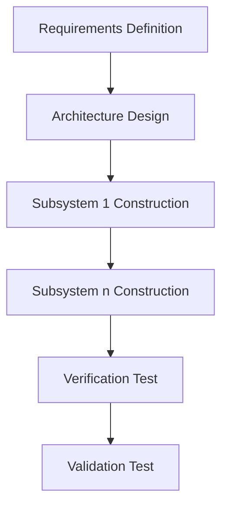
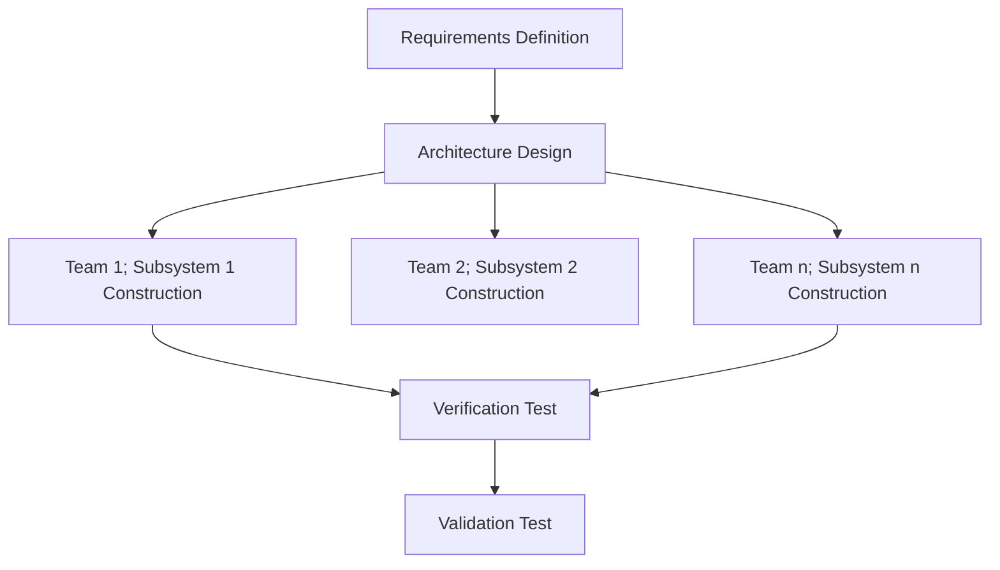

# **Types of Incremental Model**

Staged Delivery Model/Parallel Development Model

---
hideInToc: true
---

## **Staged Delivery Model**

- Develops software in a sequence of planned stages, each stage delivers a functional part of the system.
- Each release brings the product closer to completion.
- Working versions are delivered at regular intervals -> visible and manageable progress.

---
class: text-center
---

<Footnotes>
    Staged Delivery Model
</Footnotes>

---
hideInToc: true
---
## **Parallel Development Model**

- Divides the system into multiple modules that are developed simultaneously at the same time by different teams -> faster and more efficient development process.
- Reduces overall project time, allows teams to focus on specific functionalities concurrently.

---
class: text-center
---

<Footnotes>
    Staged Delivery Model
</Footnotes>